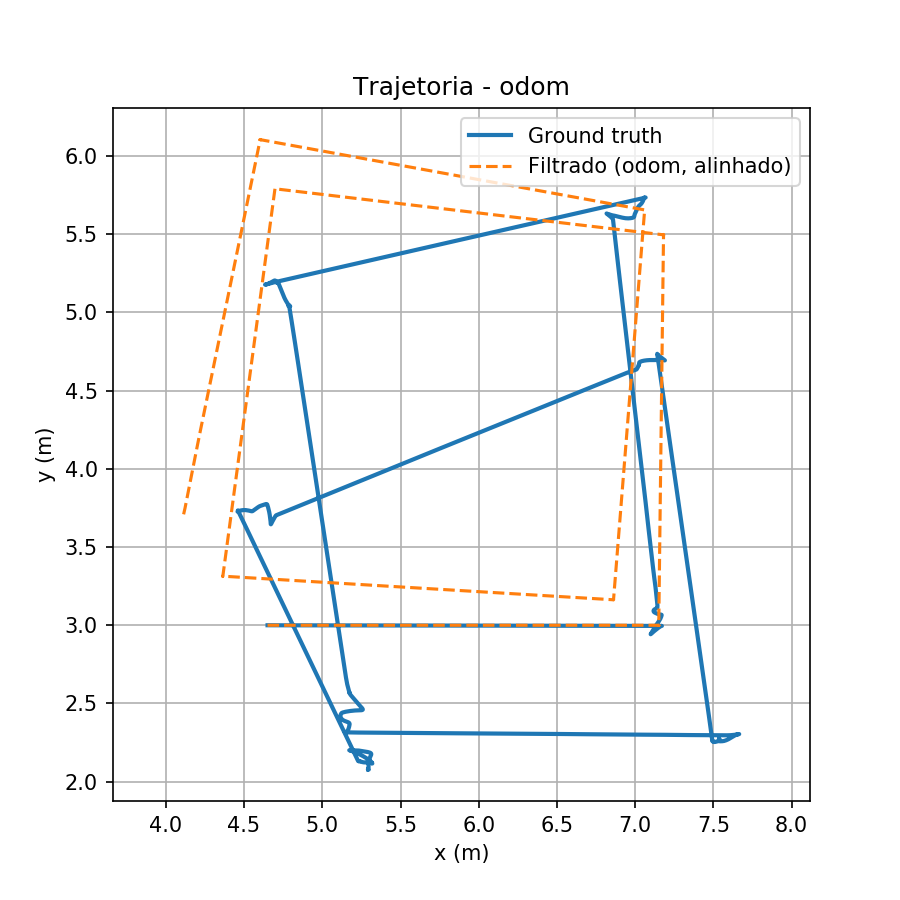
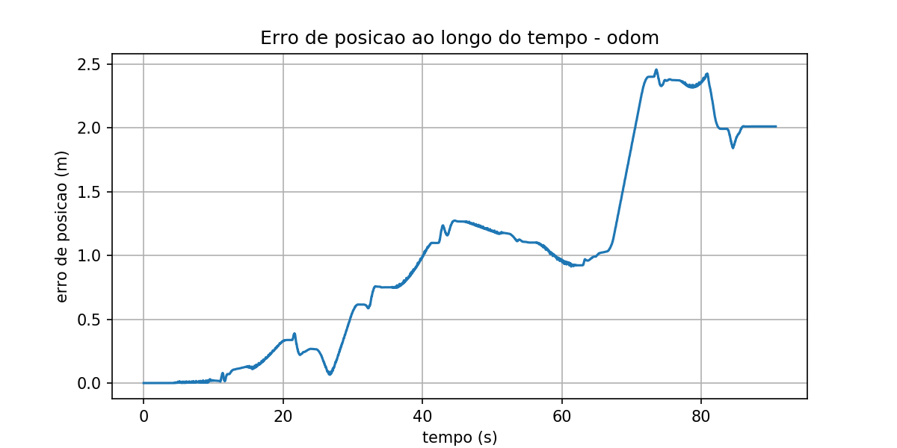
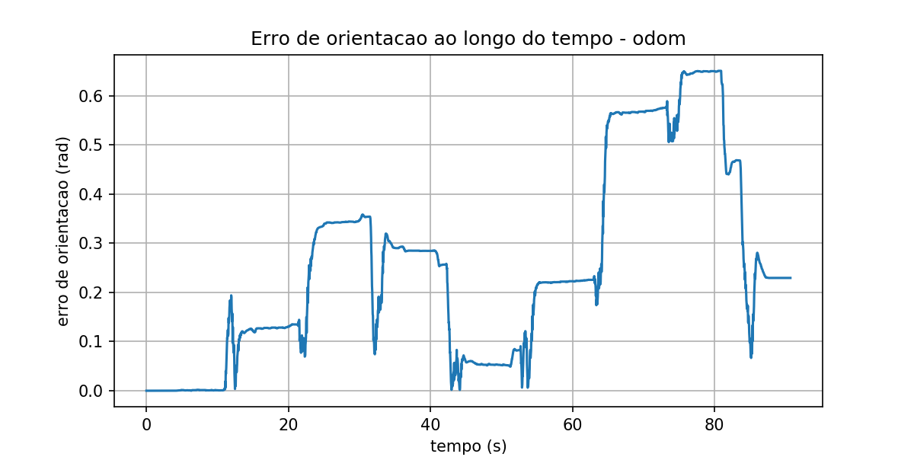
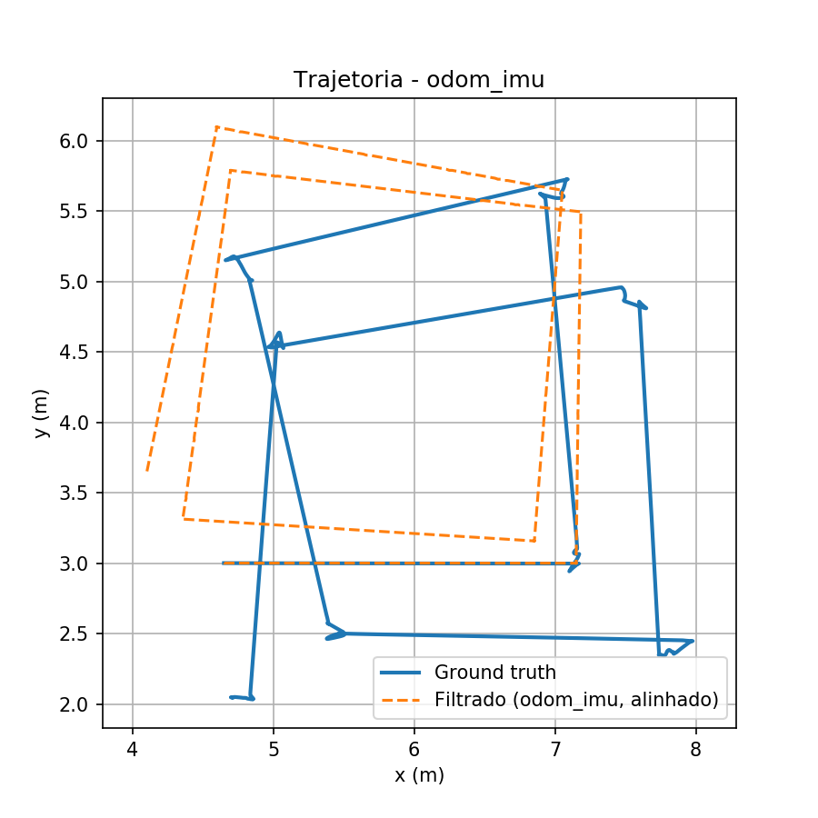
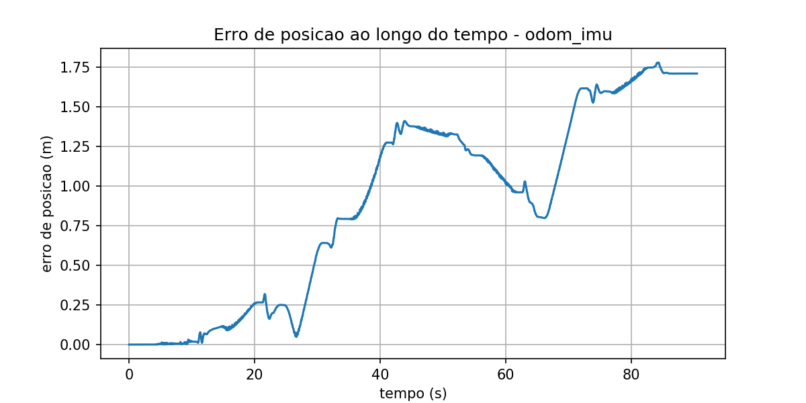
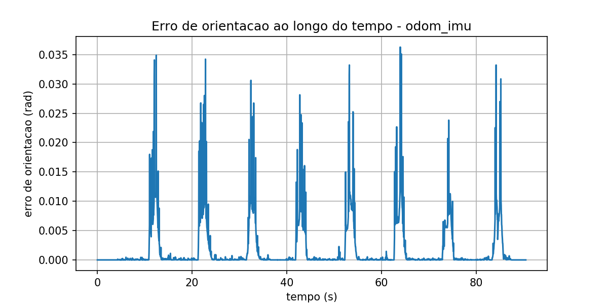
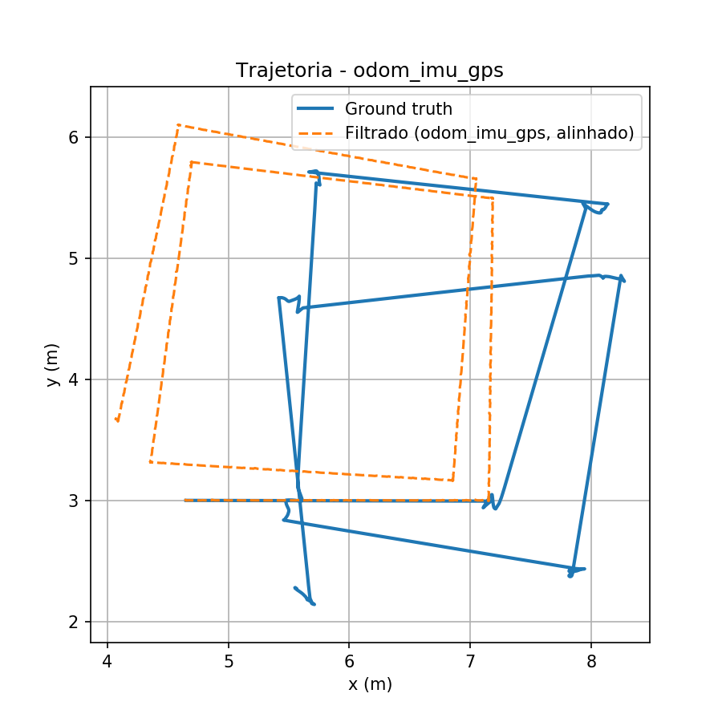
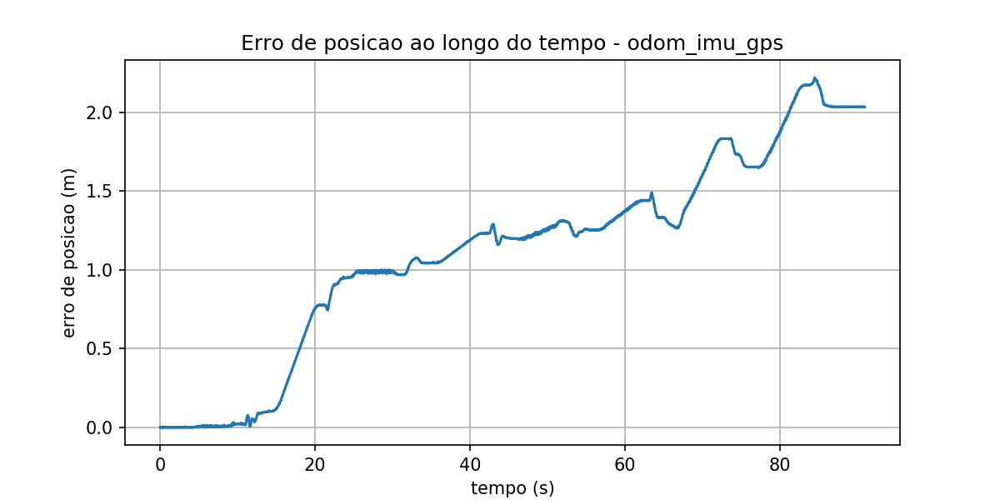
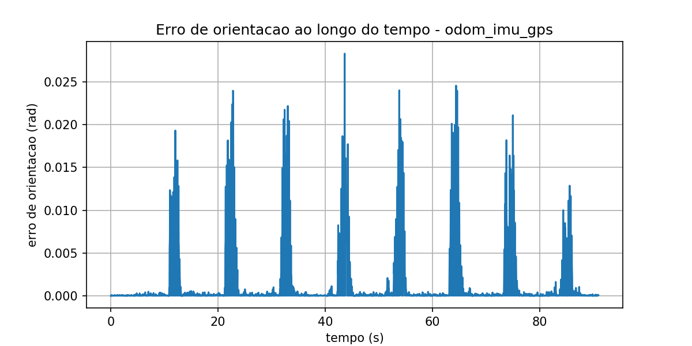

# Fusão Sensorial com Filtro de Kalman em ROS — Husky UGV (LaR UFBA)

Atividade da disciplina **Tópicos Especiais em Engenharia Elétrica IV** — UFBA.

O projeto compara três configurações de localização de um robô Husky no ambiente simulado do LaR (Gazebo), todas com **Filtro de Kalman Estendido (EKF)**, fundindo diferentes combinações de sensores:

1. odometria;
2. odometria + IMU;
3. odometria + IMU + GPS.

O GPS é simulado via plugin do Gazebo (`hector_gazebo_plugins`), publicado como `sensor_msgs/NavSatFix` em `/fix`, e convertido de latitude/longitude para coordenadas locais `x/y` por um nó próprio (`scripts/gps_to_odom.py`), que publica em `/gps/odom` (`nav_msgs/Odometry`). O ground truth vem de um plugin P3D do Gazebo, publicado em `/gt/odom`, usado só para avaliação — nunca como entrada do filtro.

Este repositório usa como base o pacote ROS [`lar_gazebo`](https://github.com/lar-deeufba/lar_gazebo) do laboratório LaR/UFBA (ambiente simulado, modelos, mundo, integração com Husky). Sobre essa base foi construído o pacote `kalman_localization` desta atividade.

## Ambiente

- ROS Noetic + Gazebo Classic 11
- Robô: Husky UGV (`husky_velocity_controller/odom`, IMU em `/imu/data`)
- Filtro: `ekf_localization_node` do pacote `robot_localization`, uma instância por configuração
- GPS simulado: `hector_gazebo_plugins` (`libhector_gazebo_ros_gps.so`)
- Ground truth: plugin P3D do Gazebo (`libgazebo_ros_p3d.so`), publicado em `/gt/odom`
- EKF nativo do Husky desabilitado (`ENABLE_EKF=false`) para não conflitar com os nós EKF deste pacote
- Execução via Docker, usando o `docker-compose` do próprio `lar_gazebo`

## Estrutura do repositório

```
kalman_localization/
├── launch/
│   ├── husky_kalman.launch        -- sobe Gazebo + Husky + ground truth + GPS
│   ├── ekf_odom.launch            -- EKF: só odometria
│   ├── ekf_odom_imu.launch        -- EKF: odometria + IMU
│   └── ekf_odom_imu_gps.launch    -- EKF: odometria + IMU + GPS
├── config/
│   ├── ekf_odom.yaml
│   ├── ekf_odom_imu.yaml
│   └── ekf_odom_imu_gps.yaml
├── urdf/
│   └── kalman_extras.urdf         -- plugins P3D (ground truth) + GPS (hector)
├── scripts/
│   ├── gps_to_odom.py             -- NavSatFix (/fix) -> Odometry (/gps/odom)
│   ├── drive_pattern.py           -- trajetória repetível (quadrado, 2 voltas)
│   ├── turn_test.py               -- script auxiliar de calibração (testa giros isolados de 90°)
│   ├── run_experiment.sh          -- orquestra um teste completo
│   └── compute_metrics.py         -- RMSE, erro final, erro de orientação
├── results/
│   ├── odom/, odom_imu/, odom_imu_gps/   -- métricas e gráficos de cada execução
│   └── *.bag                      -- rosbags brutos de cada execução
└── docker-compose.override.yml.example
```

## Como executar

### 1. Clonar os dois repositórios

O ambiente de simulação (`lar_gazebo`) é fornecido pelo curso e é separado deste pacote:

```bash
mkdir -p ~/lar_ws && cd ~/lar_ws

# Workspace de simulação (fornecido pelo curso)
git clone https://github.com/lar-deeufba/lar_gazebo.git

# Este pacote (localização com EKF)
git clone <URL-deste-repositorio> kalman_localization
```

Estrutura esperada ao final:

```
~/lar_ws/
├── lar_gazebo/            (clonado do curso)
└── kalman_localization/   (este repositório)
```

### 2. Conectar o pacote ao workspace via Docker volume

Copie `kalman_localization/docker-compose.override.yml.example` para a raiz do `lar_gazebo`, renomeie para `docker-compose.override.yml` e ajuste o caminho absoluto:

```yaml
services:
  lar_gazebo:
    volumes:
      - /caminho/absoluto/para/kalman_localization:/ws/src/kalman_localization:rw
```

> Esse arquivo é específico de cada máquina (tem paths absolutos), por isso não faz parte deste repositório.

### 3. Build da imagem e subida do ambiente

```bash
cd ~/lar_ws/lar_gazebo
docker compose up -d
./scripts/shell.sh
```

Isso abre um terminal dentro do container. Para abrir terminais adicionais no mesmo container, rode `docker ps` no host para pegar o nome do container e use `docker exec -it <nome_do_container> bash`.

Dentro do container, na primeira vez (ou se apagar `build`/`devel`):

```bash
cd /ws
catkin build
source devel/setup.bash
```

### 4. Variáveis de ambiente obrigatórias

Exporte em todo terminal novo que for rodar o `roslaunch` principal:

```bash
export ENABLE_EKF=false
export HUSKY_URDF_EXTRAS=$(rospack find kalman_localization)/urdf/kalman_extras.urdf
```

- `ENABLE_EKF=false` desliga o EKF padrão do `husky_control`, que senão conflita de nome com os EKFs deste pacote.
- `HUSKY_URDF_EXTRAS` garante que o ground truth (`/gt/odom`) e o GPS (`/fix`) sejam publicados — sem isso as métricas falham por falta desses tópicos.

(O launch `husky_kalman.launch` já define essas variáveis internamente via `<env>`, mas é bom exportar no shell também, principalmente ao rodar nós manualmente.)

### 5. Terminal 1 — subir a simulação

```bash
roslaunch kalman_localization husky_kalman.launch
```

Sobe o mundo do LaR, o Husky, o ground truth (`/gt/odom`) e o GPS (`/fix` → `/gps/odom` via `gps_to_odom.py`). Deixe este terminal rodando.

### 6. Terminal 2 — rodar um experimento completo

```bash
rosrun kalman_localization run_experiment.sh odom
rosrun kalman_localization run_experiment.sh odom_imu
rosrun kalman_localization run_experiment.sh odom_imu_gps
```

Cada chamada sobe o EKF da configuração escolhida, executa a trajetória automática (`drive_pattern.py`, um quadrado de 2 voltas com lado por tempo e giro por feedback de yaw), grava um rosbag de `/odometry/filtered` e `/gt/odom`, e calcula as métricas ao final.

Entre cada execução, reinicie a simulação (Ctrl+C no terminal 1, confira que não sobrou `gzserver`/`rosmaster` zumbi, repita o passo 5) para que as três trajetórias comecem do mesmo estado inicial.

### 7. Rodando manualmente (sem o script de orquestração)

```bash
roslaunch kalman_localization ekf_odom.launch          # ou ekf_odom_imu / ekf_odom_imu_gps
rosrun kalman_localization drive_pattern.py
rosbag record -O results/odom.bag /odometry/filtered /gt/odom
rosrun kalman_localization compute_metrics.py results/odom.bag odom results
```

### 8. Resultados gerados

Cada execução produz, em `results/<config>/`:

- `metrics.csv` — série temporal completa (pose filtrada, ground truth, erro de posição e de orientação por amostra)
- `summary.txt` — RMSE, erro final, número de amostras
- `trajetoria.png`, `erro_posicao.png`, `erro_orientacao.png`

## Nota sobre o cálculo das métricas — alinhamento de frame

O tópico `/odometry/filtered` é publicado no frame `odom`, que por convenção começa em (0, 0, 0) no instante em que o EKF sobe, independente de onde o robô esteja de fato no mundo. Já `/gt/odom` é publicado no frame do mundo do Gazebo, ou seja, na posição real onde o Husky foi colocado na simulação.

Esses dois frames não coincidem (nestes testes, por um offset fixo de `dx ≈ 4,65 m`, `dy ≈ 3,00 m`, igual nas três execuções). Sem corrigir isso, o erro de posição fica inflado por uma diferença de referência que não tem nada a ver com a qualidade da estimativa do EKF.

Por isso, `compute_metrics.py` alinha a trajetória filtrada ao ground truth antes de calcular qualquer erro: pega a primeira pose de cada série, calcula a rotação (diferença de yaw) e a translação que levam a origem do `odom` até a pose inicial do ground truth, e aplica essa transformação em toda a trajetória filtrada. Os valores abaixo já estão pós-alinhamento.

## Resultados

### Métricas quantitativas

| Configuração   | RMSE posição (m) | Erro final posição (m) | RMSE orientação (rad) | Erro final orientação (rad) | Amostras |
|-----------------|:-----------------:|:------------------------:|:------------------------:|:------------------------------:|:----------:|
| `odom`          | 1,2669             | 2,0124                    | 0,3205                    | 0,2295                          | 2722       |
| `odom_imu`      | 1,0822             | 1,7092                    | 0,0046                    | 0,0000                          | 2716       |
| `odom_imu_gps`  | 1,2793             | 2,0328                    | 0,0038                    | 0,0001                          | 2731       |

Cada execução durou cerca de 91 s e percorreu duas voltas de um quadrado de lado fixo, com giros de 90° controlados por feedback real de yaw (não por tempo), para as três trajetórias ficarem comparáveis entre si.

### Análise visual por configuração

**`odom` — só odometria**

<p align="center">    </p>

Na trajetória, a curva filtrada (laranja) vai se afastando do ground truth (azul) a cada lado do quadrado, sem corrigir o desvio acumulado — a assinatura clássica de deriva de odometria pura. O erro de posição também não sobe em linha reta: acelera depois de cada giro de 90°, que é onde a derrapagem das rodas introduz mais erro de yaw, e esse erro passa a contaminar a integração da posição dali pra frente. No erro de orientação isso fica mais claro ainda: em vez de picos, aparecem patamares — o erro sobe durante o giro e fica praticamente constante no trecho reto seguinte, já que nada está corrigindo o yaw enquanto o robô anda reto.

**`odom_imu` — odometria + IMU**

<p align="center">    </p>

Aqui a trajetória filtrada já acompanha bem mais de perto o ground truth, com bem menos abertura entre as duas curvas. O gráfico de erro de orientação muda de forma em relação ao `odom` puro: em vez dos patamares que iam se acumulando, aparecem picos curtos e isolados, exatamente nos 8 giros de 90° da trajetória (2 voltas × 4 lados), e o erro cai de volta pra perto de zero assim que o robô estabiliza na linha reta seguinte. É o giroscópio da IMU corrigindo o yaw em tempo real, sem deixar o erro acumular de um giro pro outro. O erro de posição ainda oscila ao longo do percurso, mas sem aquela tendência de só crescer do caso anterior.

**`odom_imu_gps` — odometria + IMU + GPS**

<p align="center">    </p>

O erro de orientação fica quase igual ao do `odom_imu` (mesmos picos curtos nos giros, mesma ordem de grandeza), o que já era esperado, já que GPS não mede orientação. O erro de posição, por outro lado, lembra mais a curva do `odom` puro: sobe e fica num patamar alto na segunda metade do percurso, passando de 1,5 m e chegando a quase 2,2 m, diferente do `odom_imu`, que oscilava mas se mantinha mais baixo. Na trajetória também dá pra notar a curva filtrada um pouco mais "encolhida" e deslocada em relação ao ground truth do que no `odom_imu`, como se a correção do GPS não estivesse conseguindo competir com o peso que o filtro dá à odometria nessa configuração de covariância.

## Discussão

**Só odometria (`odom`).** Foi a configuração com o pior erro de orientação das três (RMSE de 0,32 rad, erro final de 0,23 rad). A odometria de rodas estima a pose integrando velocidade ao longo do tempo, sem nenhuma referência externa pra corrigir essa integração, então qualquer erro pequeno — derrapagem, folga no encoder — vai se acumulando sem nada que o segure. No gráfico de erro de orientação isso aparece como degraus: cada giro de 90° soma mais erro, chegando a 0,65 rad perto dos 75 s antes de cair um pouco no final. O erro de posição segue parecido, mas não cresce sem parar: sobe até uns 1,27 m perto dos 45 s, cai um pouco quando a trajetória se aproxima da referência de novo, e volta a subir até o pico de ~2,46 m perto dos 73 s.

**Adicionando IMU (`odom_imu`).** Foi a configuração com o melhor resultado nas duas métricas: RMSE de posição caiu de 1,27 m pra 1,08 m, e o de orientação despencou de 0,32 rad pra 0,0046 rad — quase 70 vezes menor. A IMU mede velocidade angular direto pelo giroscópio, sem depender de rodas que podem derrapar, então o EKF passa a ter uma fonte de orientação muito mais confiável. No gráfico de erro de orientação dá pra ver isso bem: em vez dos patamares crescentes do `odom` puro, aparecem picos curtos (até ~0,036 rad) só nos instantes de giro, voltando pra perto de zero logo depois, sem acumular nada entre um giro e outro. Como a posição é calculada a partir da orientação, corrigir o yaw também ajudou a reduzir o erro de posição — mesmo sem ter entrado nenhum sensor novo de posição.

**Adicionando GPS (`odom_imu_gps`).** Esse foi o resultado mais curioso de explicar. A expectativa, em teoria, era o GPS melhorar ainda mais a estimativa em relação ao `odom_imu`, já que dá uma referência absoluta de posição. Mas o RMSE de posição ficou praticamente igual ao do `odom` sozinho (1,28 m vs. 1,27 m) e até pior que o `odom_imu` (1,28 m vs. 1,08 m). O erro de orientação seguiu a mesma linha do `odom_imu` (RMSE de 0,0038 rad), o que é esperado — GPS não mede orientação, quem resolve esse eixo continua sendo a IMU.

Acho que duas coisas explicam o GPS não ter ajudado na posição aqui. A primeira é que o GPS simulado tem ruído gaussiano e drift configurados no plugin (`gaussianNoise: 0.05 0.05 0.1`, `drift: 0.3 0.3 0.5`) e, numa trajetória de só ~91 s, talvez não tenha dado tempo do EKF integrar correções suficientes pra esse ruído convergir num ganho real. A segunda é que a covariância de posição que dei ao GPS na config do EKF pode estar relativamente alta perto da confiança que o filtro já tinha em odometria+IMU, o que faz o GPS pesar pouco na fusão. De qualquer forma, é um resultado válido pra reportar: mostra que só jogar mais um sensor no filtro não garante melhora — depende de como o ruído e a covariância desse sensor estão calibrados em relação aos outros, e de a trajetória ser longa o bastante pra deriva acumulada de odometria/IMU justificar a correção que o GPS oferece.

## Conclusão

A IMU foi o sensor que fez mais diferença sozinha: resolveu o problema central da odometria pura, que era a orientação indo embora sem nenhuma correção, e isso acabou melhorando a posição também, mesmo sem entrar nenhum sensor novo de posição absoluta. Já o GPS, com a configuração de ruído/covariância usada aqui e numa trajetória curta, não trouxe ganho em cima do que a IMU já entregava — o RMSE de posição ficou no mesmo nível do `odom` puro. Isso não quer dizer que o GPS seja inútil de forma geral, só que nessas condições a fusão como ficou configurada não aproveitou a referência absoluta que ele oferece. Acho que valeria testar com trajetórias mais longas (a deriva de odometria/IMU teria mais espaço pra crescer, e o GPS mais chance de mostrar vantagem) ou ajustar melhor a covariância do GPS no EKF.

## Limitações conhecidas

- O GPS é convertido de lat/lon pra `x/y` local com uma projeção equirretangular simplificada (`scripts/gps_to_odom.py`), válida só para áreas pequenas como esta simulação — não deve ser usada como está em aplicações reais maiores (precisaria de uma projeção geodésica de verdade, como UTM).
- O GPS simulado tem referência fixa em `(lat0, lon0) = (0, 0)` e ruído idealizado (gaussiano + drift do plugin), o que não reproduz toda a complexidade de um receptor real (multipath, perda de fix, etc.).
- A trajetória de teste dura ~91 s — o suficiente para comparar as três configurações entre si, mas provavelmente curta demais pra deriva acumulada de odometria/IMU justificar de fato a correção que o GPS deveria trazer em teoria.
- IMU e odometria do Husky no Gazebo têm ruído idealizado em relação ao hardware real; os números absolutos não devem ser extrapolados direto pro robô físico.

## Autor

Lucas Fialho — UFBA, Tópicos Especiais em Engenharia Elétrica IV
